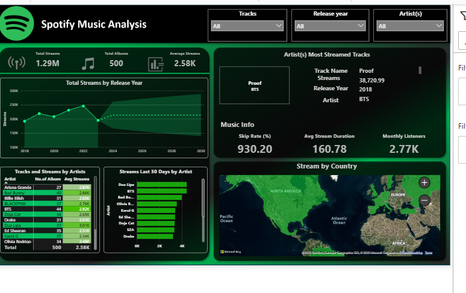

# 🎵 Spotify Music Analysis Dashboard

A Power BI dashboard for analyzing and visualizing Spotify streaming data, providing insights on artists, tracks, and global listening patterns.

## 📊 Project Overview

This interactive dashboard provides comprehensive analytics on music streaming data from Spotify, including:

- Total streams, albums, and average stream metrics
- Historical streaming trends by release year
- Artist performance comparisons
- Geographic distribution of listeners
- Most streamed tracks and performance metrics

## 🔍 Key Features

- **Stream Analysis**: Track total streams (1.29M), albums (500), and average streams per track (2.58K)
- **Time-based Trends**: Visualization of streaming patterns by release year
- **Artist Comparisons**: Performance metrics across artists like BTS, Ariana Grande, Drake
- **Geographic Insights**: Heat map showing streams by country with interactive filters
- **Track Performance**: Detailed analysis of top tracks including stream counts, skip rates, and duration

## 📷 Dashboard Preview

## 🛠️ Technologies Used

- **Power BI**: For data visualization and interactive dashboards
- **DAX**: Custom calculations for streaming metrics
- **Map Visualizations**: For geographic data representation

## 📋 Usage Instructions

1. Download the `.pbix` file from this repository
2. Open using Power BI Desktop
3. Interact with the filters at the top to analyze:
   - Specific tracks
   - Release years
   - Artists

## 🔄 Data Sources

This dashboard uses simulated Spotify streaming data with metrics for:
- Stream counts
- Skip rates
- Stream duration
- Geographic distribution
- Artist and track performance

## 📈 Insights Available

- BTS's "Proof" is the most streamed track with 38,729.59 streams
- Average skip rate is 930.20%
- Average stream duration is 160.78 (units)
- Monthly listeners average 2.77K
- Top artists by total streams include BTS, Ariana Grande, and Drake

## 🔗 My Other Projects:
- [Business Insights Analysis using Power BI](https://github.com/Kiran8897/Business-Insights-Analysis-using-PowerBI)
- [SQL_Employee_Project](https://github.com/Kiran8897/SQL_Employee_-Project)
- [My GitHub Profile 🧠](https://github.com/Kiran8897)
- [LinkedIn Profile 👋](https://www.linkedin.com/in/saikiran-yadla-897304198/)

---

> ✅ _Created and maintained by **Saikiran Yadla**_
